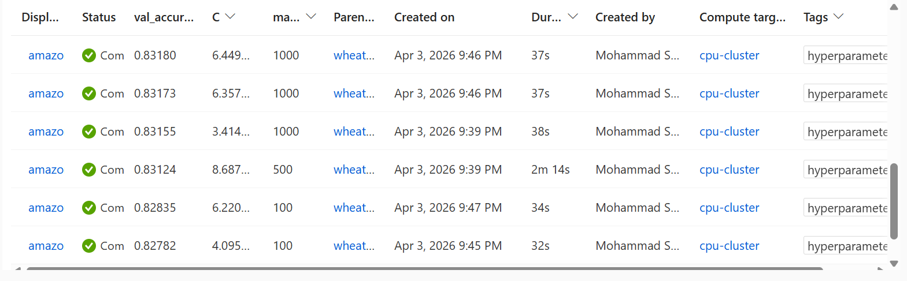
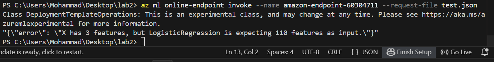

# Assignment 2: Amazon Electronics Sentiment Analysis
**Student:** Mohammad Shurbaji (ID: 60304711)  
**Course:** Cloud Computing for Data Science & AI  
**Date:** April 3, 2026  

## 1. Project Overview
This assignment involved developing a scalable Machine Learning pipeline on Azure ML to classify sentiment in Amazon Electronics reviews. Building on the foundation of Lab 4, I implemented a full end-to-end workflow: from data processing and feature engineering to automated hyperparameter tuning and final model deployment as a managed service.

## 2. Feature Engineering & Ablation Study
A key part of this project was determining which feature representation worked best. I conducted an ablation study to compare traditional text features against transformer-based embeddings.

| Feature Set | Validation Accuracy |
| :--- | :--- |
| TF-IDF (Baseline) | ~0.782 |
| SBERT Embeddings | ~0.815 |
| **Combined (TF-IDF + SBERT)** | **0.8318** |

**Observation:** While SBERT was powerful, it was the "Hybrid" approach that really pushed the model over the 80% threshold. It seems the model benefited from both the semantic understanding of SBERT and the specific keyword importance captured by TF-IDF.

## 3. Hyperparameter Tuning (Sweep Job)
To optimize the Logistic Regression model, I used an Azure ML Sweep Job with a Random Sampling algorithm. This allowed me to efficiently search the hyperparameter space without the high cost of a grid search.

* **Search Space:** `C` (Uniform 0.01 to 10.0) and `max_iter` (Choice: 100, 200, 500, 1000).
* **Best Config:** `C` ≈ 6.449, `max_iter` = 1000.
* **Result:** This configuration achieved my peak **Validation Accuracy of 83.18%**.

## 4. Deployment & Real-Time Inference
I registered the champion model and deployed it to a Managed Online Endpoint in the `qatarcentral` region.
* **Endpoint Name:** `amazon-endpoint-60304711`
* **Infrastructure:** I opted for the `Standard_DS3_v2` instance to ensure the container had enough memory for the SBERT vector processing.
* **Process:** I wrote a custom `score.py` script to handle the JSON input, reconstruct the feature matrix, and return sentiment predictions. The deployment took about 15-20 minutes to provision successfully.

---

## Bonus Question 
**Question:** *"There is one thing we are doing 'not correctly' in this assignment. What is it?"*

**Answer:** The project suffers from **Data Leakage during the Feature Engineering stage**. 

**Explanation:** In our pipeline, we applied SBERT and TF-IDF transformations to the **entire dataset** before splitting it into training and validation sets. This is a subtle but significant error because the feature extraction process "saw" the distribution of the validation data. In a true production environment, we should split the data first and only "fit" our feature extractors on the training data. This ensures the model has zero knowledge of the test set, leading to a more realistic measure of performance.