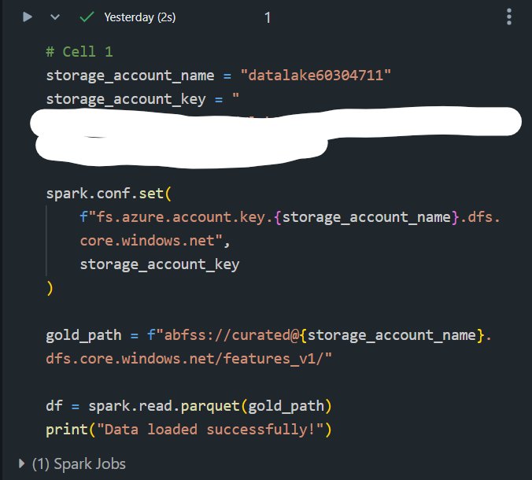
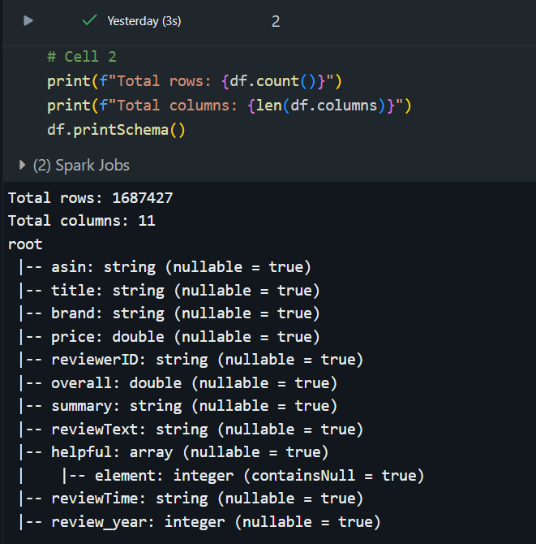
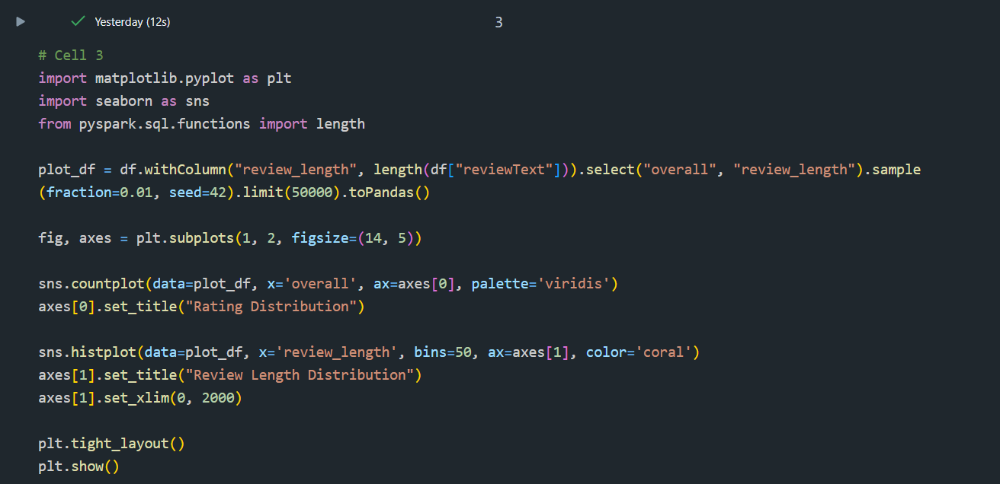
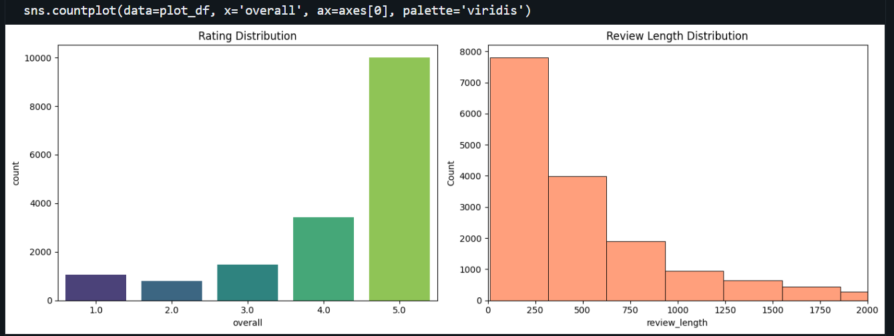
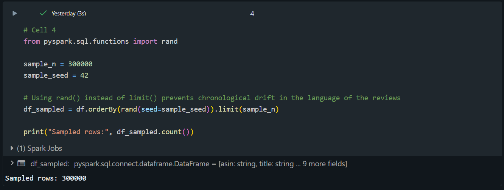
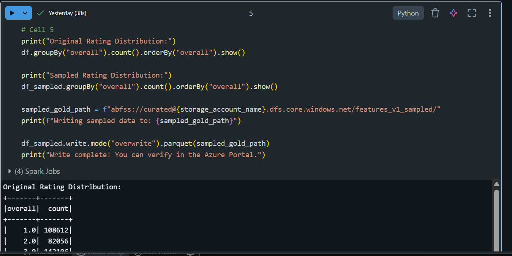

# Lab 4: Azure ML Feature Engineering Pipeline

## Overview
This repository contains an end-to-end feature engineering pipeline built using Azure Machine Learning. The pipeline processes Amazon Electronics reviews to extract meaningful features for downstream machine learning models. The final output is a highly enriched dataset registered in the Azure ML Feature Store.

## Pipeline Steps
1. **Data Splitting (`split_dataset`):** Splits the initial Gold dataset into Training, Validation, and Testing sets to prevent data leakage during feature extraction.
2. **Text Normalization (`normalize_text`):** Cleans the raw review text by lowercasing, removing punctuation, and stripping extra whitespace to ensure consistent feature extraction.
3. **Feature Extraction:** A series of parallel components extract different mathematical and semantic representations of the text.
4. **Merge Features (`merge_all`):** Joins all extracted features back together based on the primary entity keys (`asin` and `reviewerID`) without duplicating columns.

## Engineered Features & Rationale

### 1. Review Length Features (`review_length_chars`, `review_length_words`)
* **Reason:** The length of a review is often highly correlated with its helpfulness or the extremity of the user's sentiment. Longer reviews tend to indicate strong opinions (either highly positive or highly negative) and provide more context for models to learn from.

### 2. Sentiment Features (`sentiment_pos`, `sentiment_neg`, `sentiment_neu`, `sentiment_compound`)
* **Reason:** Using NLTK's VADER lexicon, we extract the inherent emotional tone of the review. These features give downstream models a direct numerical proxy for user satisfaction without needing to learn complex language rules from scratch.

### 3. TF-IDF Features (`tfidf_...`)
* **Reason:** Term Frequency-Inverse Document Frequency transforms text into a sparse numerical matrix. It highlights words that are frequent in a specific review but rare across the entire dataset, effectively identifying the most "important" keywords driving each review. Note: The vectorizer is fit *only* on the training set to prevent data leakage.

### 4. Semantic Embeddings (`bert_embedding`)
* **Reason:** Using Hugging Face's `sentence-transformers` (`all-MiniLM-L6-v2`), we extract dense, contextual vector representations of the text. Unlike TF-IDF, BERT embeddings capture the actual *meaning* and sequence of words, allowing downstream models to understand complex phrasing, sarcasm, and context.

### 5. Bonus Features (`lexical_diversity`, `avg_word_length`)
* **Reason:** We engineered two additional features to measure "Review Complexity." Lexical diversity (ratio of unique words to total words) and average word length help capture the vocabulary richness of the reviewer. This can be a strong predictor for how helpful or reliable a review might be to other customers.

## Final Output
The final enriched dataset contains all original attributes joined with the newly engineered features. It has been successfully registered as a versioned Feature Set (`amazon_review_text_features:1`) linked to the `AmazonReview` entity within the Azure ML Feature Store for reuse in future modeling labs.

### Cell 1: Secure Data Ingestion and Setup
**Explanation:** This cell configures the Spark environment to securely connect to the Azure Data Lake Storage (ADLS) using the storage account credentials. It reads the curated "gold" tier parquet files into a PySpark DataFrame (`df`). 

**Why it matters for Feature Engineering:** Before any feature extraction or exploratory data analysis (EDA) can happen, the data must be ingested into a scalable, distributed computing environment. Loading the data into a PySpark DataFrame allows us to efficiently handle the massive volume of Amazon review data and sets the foundation for analyzing text lengths and rating distributions in the subsequent steps.

### Cell 2: Dataset Inspection and Schema Validation
**Explanation:** This cell calculates the total size of the ingested dataset (over 1.6 million rows and 11 columns) and prints the schema, detailing the data type of each column. 

**Why it matters for Feature Engineering:** Understanding the dataset's scale and structure is the critical first step before building a pipeline. The massive row count confirms the need for distributed processing, and the schema identifies the specific columns we need to target. For example, it confirms our primary entity keys (`asin`, `reviewerID`), our main text sources for NLP feature extraction (`reviewText`, `summary`), and our baseline rating variable (`overall`).

### Cell 3: Exploratory Data Analysis - Ratings and Review Lengths
**Explanation:** This cell takes a representative sample of the dataset, calculates the character length of the text in each review, and uses `matplotlib` and `seaborn` to plot two key visualizations side-by-side: a count plot of the overall ratings and a histogram of the review lengths.

**Why it matters for Feature Engineering:** * **Rating Distribution:** Visualizing the ratings helps us identify class imbalance. E-commerce reviews are often heavily skewed towards 5-star ratings. Knowing this distribution is critical for downstream modeling, as it dictates whether we need to stratify our train/test splits or apply balancing techniques so the model doesn't just guess "5 stars" every time.
* **Review Length Distribution:** This histogram validates our decision to engineer length-based features. It shows the variance in how much users write and helps us spot potential outliers (like suspiciously short 1-word reviews or artificially long spam). Understanding this distribution helps us decide if we need to normalize or cap text lengths before feeding them into embedding models like BERT.

### Cell 4: Representative Data Sampling
**Explanation:** This cell extracts a random, reproducible subset of 300,000 rows from the full dataset. By using the `rand()` function to shuffle the dataset before limiting it, rather than just taking the first 300,000 rows, it actively prevents chronological bias (where older reviews might use different terminology or feature outdated products compared to newer ones). 

**Why it matters for Feature Engineering:** Processing 1.6 million rows for complex NLP features (especially deep learning embeddings like BERT) requires massive compute power and time. Random sampling creates a statistically representative dataset that is small enough to process efficiently during pipeline development, while still being large and diverse enough to train accurate, unbiased machine learning models downstream.

### Cell 5: Sample Validation and Persisting to Storage
**Explanation:** This cell performs a final sanity check by comparing the distribution of ratings (`overall`) in the original dataset against our new 300,000-row sample. Once validated, it writes the sampled DataFrame back to the Azure Data Lake Storage (ADLS) in the highly efficient Parquet format. 

**Why it matters for Feature Engineering:** 1. **Validation:** Checking the distribution ensures our random sampling didn't accidentally drop all the minority classes (like 1-star reviews), which would completely skew our downstream machine learning models.
2. **The Cloud Bridge:** Saving this sampled dataset back to Azure storage is what actually connects this exploratory notebook to the Azure ML pipeline. The `features_v1_sampled` directory created here acts as the exact starting point (the raw data input) for the `split_dataset` and `normalize_text` components we engineered in the cloud pipeline.